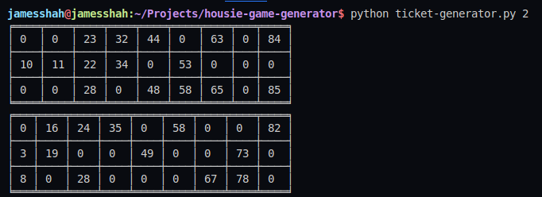

## Housie(Tambola) Tickets Generator Using Python

### About

A housie ticket consists of a random distribution of 15 unique numbers between 1-90 in a 3x9 matrix.
Here is an example of a ticket.

**RULE #1** - Each row cannot have more than 5 numbers

**RULE #2** - Each column is assigned a range of numbers only: (ex. 1-10 can appear only in column 1)

**RULE #3** - In a specific column, numbers must be arranged in ascending order from top to bottom

### Requirements

* [Python](https://www.python.org)
* [numpy](https://numpy.org/) (python package)
* [tabulate](https://pypi.org/project/tabulate/) (python package)

### Usage

* Clone this repository.
* Run code using  `python ticket-generator.py [number of tickets you want to generate]`
  
### Example

`python ticket-generator.py 2`

